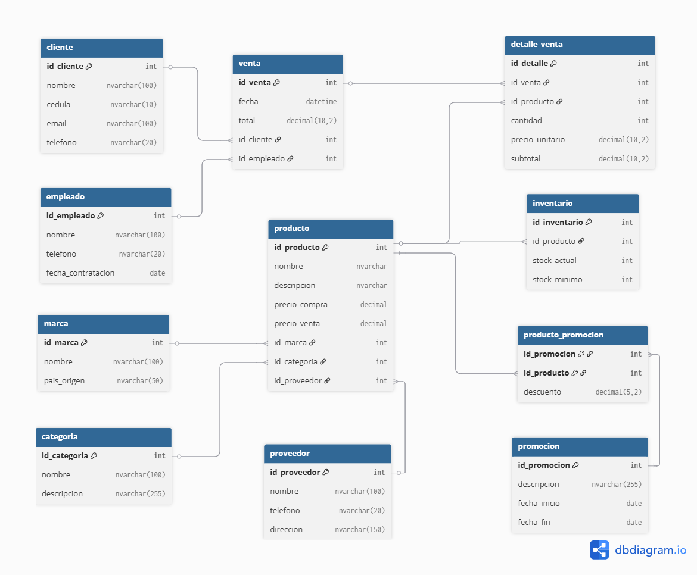

<h1>🛒 SUPERMERCADO</h1>

<strong>Sistema de Base de Datos para un Supermercado</strong>

 
<h4>🎯 Objetivo General</h2>

Desarrollar un sistema seguro en SQL Server para la gestión de un supermercado.

 
<h4>⚙ Tecnologías usadas</h4>

- SQL Server - Cifrado y hashing - MySQL - Clever Cloud - JDBC - Git Hub

 
<h4>👩‍💻 Autores</h4>

- Nayely Ayol - Alessia Perez

 
<h4>👁 Modelo Entidad Relación de la Base de Datos</h4>

  

 
<h4>🎥 Video tutorial del sistema del Supermercado</h4>
<a href="https://youtu.be/UeBhBLj7d1Q" target="_blank" style="background-color: #2196F3; color: white; padding: 10px 15px; text-decoration: none; border-radius: 5px;">
  Ver Video
</a>
